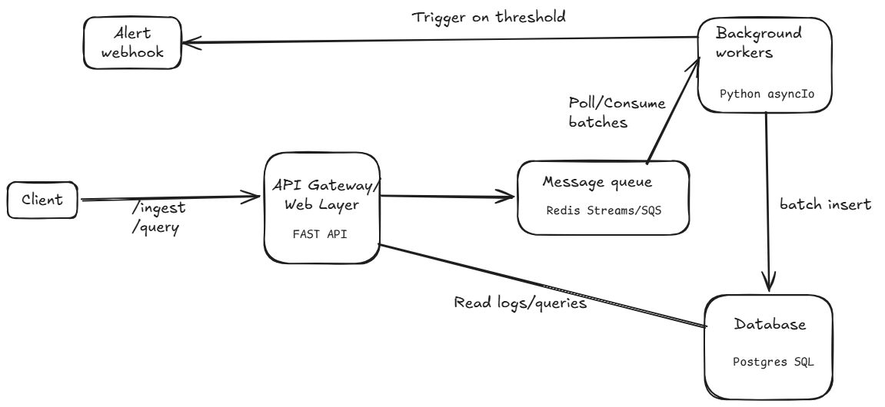

# Distributed Async Log & Alert Processing Engine

## 1. Product Overview

**Objective:** Build a headless, high-throughput, event-driven backend system that acts as a centralized logging service. It must ingest high volumes of application logs from various microservices, queue them for asynchronous processing, persist them efficiently, and trigger real-time alerts when error thresholds are breached.

**Why this project is high-signal:** It demonstrates to an interviewer that you understand decoupling (API vs. Workers), load leveling (using queues to handle traffic spikes), idempotency, rate limiting, and time-series data indexing.

## 2. Functional Requirements (FRs)

*The system must strictly support the following capabilities:*

1. **Log Ingestion Endpoint:** A REST API endpoint that accepts JSON log payloads from client services.
2. **Client Rate Limiting:** The API must reject requests (HTTP 429) from any single `client_id` that exceeds 100 logs per second to protect the system from noisy neighbors.
3. **Asynchronous Processing:** The API must *not* write directly to the database. It must validate the payload, push it to a message queue, and immediately return an HTTP 202 (Accepted).
4. **Batch Processing:** Background workers must pull logs from the queue in batches (e.g., 50 at a time) to optimize database insert performance.
5. **Threshold Alerting:** The background worker must evaluate a sliding window of recent logs. If a specific `client_id` generates more than 10 `ERROR` level logs in a 1-minute window, it must trigger a webhook alert (e.g., a mock Slack notification).
6. **Query & Aggregation:** A REST API endpoint to query logs by `client_id`, `log_level`, and a `timestamp` range.

## 3. Non-Functional Requirements (NFRs)

*The system must meet these performance and reliability standards:*

1. **Ingestion Latency:** The ingestion API must respond in `< 15ms` (P99 latency).
2. **Fault Tolerance:** If the PostgreSQL database goes down, the API must continue accepting logs (they remain safely in the queue).
3. **Exactly-Once / At-Least-Once Processing:** The system must guarantee that no logs are lost if a worker crashes midway through processing (requires queue acknowledgment mechanisms).
4. **Concurrency:** The system must be capable of running multiple independent worker nodes simultaneously without duplicating alerts or dropping messages.

## 4. System Architecture & Components

## 4. System Architecture & Components


1. **API Gateway / Web Layer (FastAPI):**
   - Exposes the `/ingest` and `/query` endpoints.
   - Runs Redis Lua scripts for Rate Limiting.
   - Publishes valid payloads to the Message Queue.

2. **Message Broker (Redis Streams or AWS SQS):**
   - Acts as the buffer between the fast API and the slower database.
   - *Local:* Use Redis Streams. *Cloud:* Swap to AWS SQS.

3. **Background Worker Nodes (Python Asyncio / Celery):**
   - Continuously polls the queue.
   - Executes the batch database `INSERT`.
   - Evaluates the alerting rules.

4. **Primary Database (PostgreSQL):**
   - Stores the structured log data.
   - Requires heavy indexing on time and client columns for fast retrieval.

## 5. API Specifications

### A. Ingest Log

- **Endpoint:** `POST /v1/logs`
- **Response:** `202 Accepted` (or `429 Too Many Requests`)
- **Payload:**

```json
{
  "client_id": "payment-service",
  "timestamp": "2026-08-09T10:30:00Z",
  "level": "ERROR",
  "message": "Failed to connect to Stripe API",
  "metadata": {
    "retry_count": 3
  }
}
```

### B. Query Logs

- **Endpoint:** `GET /v1/logs?client_id=payment-service&level=ERROR&start_time=...&end_time=...`
- **Response:** `200 OK`
- **Payload:** Returns a paginated JSON list of logs matching the criteria.

## 6. Database Schema (PostgreSQL)

You will need a table optimized for time-series-like data.

**Table:** **`service_logs`**

| **Column Name** | **Data Type** | **Constraints** | **Description** |
|---|---|---|---|
| `id` | UUID | Primary Key | Use UUIDv7 if possible (time-ordered). |
| `client_id` | VARCHAR(50) | Not Null | E.g., `'payment-service'`. |
| `log_level` | VARCHAR(10) | Not Null | INFO, WARN, ERROR, FATAL. |
| `message` | TEXT | Not Null | The log text. |
| `metadata` | JSONB | Nullable | Unstructured extra data. |
| `created_at` | TIMESTAMP | Not Null | The exact time the log occurred. |

## 7. Getting Started (Local Development)

### Prerequisites
- Python 3.11+
- Docker & Docker Compose

### Running Locally
1. Clone the repository:
   ```bash
   git clone <repo-url>
   cd async-log-processor
   ```

2. Set up virtual environment:
   ```bash
   python3 -m venv venv
   source venv/bin/activate
   pip install -r requirements.txt
   ```
3. Start the API server:
   ```bash
   uvicorn main:app --reload
   ```
4. Access the interactive Swagger docs at http://localhost:8000/docs.
